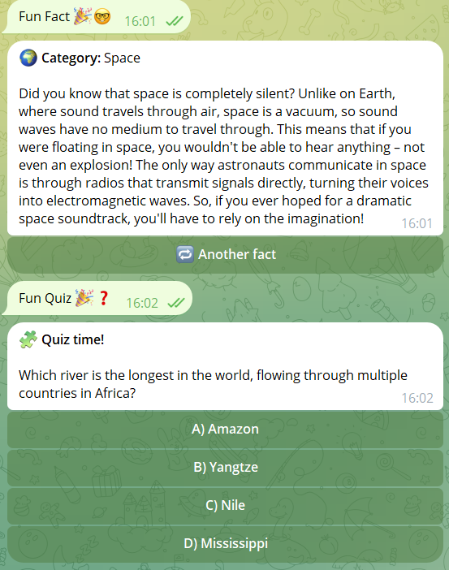
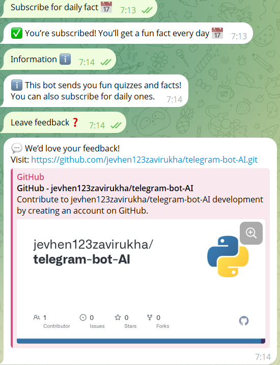

# 🤖 Telegram Bot AI


> **Smart Telegram bot powered by OpenAI GPT models**.  
> Created by [Eugene Zavirukha](https://github.com/jevhen123zavirukha).  
> Simple, extendable and intelligent assistant — right in your Telegram chat!

---

## 🚀 Features

- 💬 Chat with AI directly on Telegram  
- ⚙️ Easy setup with `.env` configuration  
- 🔁 Context-based conversation support  
- 🧩 Extendable commands (`/help`, `/quiz`, `/retry`, etc.)  
- 🔒 Secure token management  
- ☁️ Deployable to Heroku, Render, or VPS  

---

## 🧰 Tech Stack

| Technology | Purpose |
|-------------|----------|
| **Python** | Main programming language |
| **Telebot (PyTelegramBotAPI)** | Telegram API integration |
| **OpenAI API** | GPT-based responses |
| **dotenv** | Secure token handling |
| **Schedule / Threading** | Background tasks |

---

<div align="center">
  
  
  
  <p></p>
  
</div>

---

## ⚙️ Installation

```bash
# 1️⃣ Clone this repository
git clone https://github.com/jevhen123zavirukha/telegram-bot-AI.git
cd telegram-bot-AI

# 2️⃣ Install dependencies
pip install -r requirements.txt

# 3️⃣ Create your environment variables
cp .env.example .env

# Inside .env:
# TELEGRAM_TOKEN=your_telegram_bot_token
# OPENAI_API_KEY=your_openai_api_key

# 4️⃣ Run the bot
python bot.py

---

🧠 How It Works

User sends a message via Telegram

Bot sends it to the OpenAI GPT API

OpenAI generates a smart response

Bot replies back to the user

(Optional) Context is saved for conversation continuity

---

⭐ Support

If you like this project, don’t forget to ⭐ star the repo!
It motivates further development and helps others find the project.

Made with ❤️ and Python 🐍
